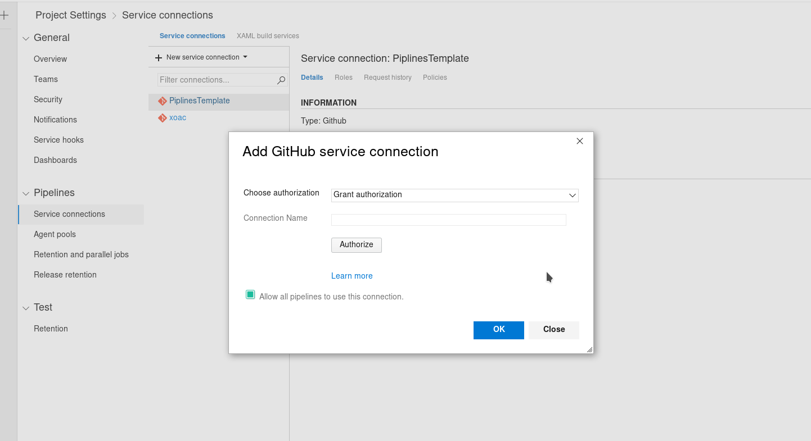

[](https://dev.azure.com/sylwesterrapala/azure-piplines/_build/latest?definitionId=3&branchName=master)

# Rust Templates for Azure Pipelines

## How to use run azure-pipelines?

1. Copy azure-pipelines.yml to your project if you don't have one Or add this resources.
```
resources:
  repositories:
    - repository: templates
      type: github
      name: xoac/rust-azure-pipelines
      endpoint: PiplinesTemplate

```
2. Specify [service connection](https://docs.microsoft.com/pl-pl/azure/devops/pipelines/library/service-endpoints?view=azure-devops)


## How to deploy doc to github pages? 
This is useful if u want to have a seperate documentaion for master branch. Everthing published to crates.io will create own documentaion.

### Github part
1. First you need to create a PAT (Personal Access Token) on Github.
2. Then create a branch `gh-pages` and us it as repo page. [Here you find how to do it](https://help.github.com/en/articles/configuring-a-publishing-source-for-github-pages#enabling-github-pages-to-publish-your-site-from-master-or-gh-pages)

### Azure part

Go to your azure dev-ops pipline project and click edit.

Go inside variables:

And add variable caled `DocPublishToken` with value of your PAT. Don't forget to mark it as seecret.


Then edit azure-pipelines.yml section with doc deploy (parameters.git) and you are done.

----

### Sources:
* [Azure Pipelines for Rust Projects](https://nbsoftsolutions.com/blog/azure-pipelines-for-rust-projects)
* [tokio-rs](https://github.com/tokio-rs/tokio)

