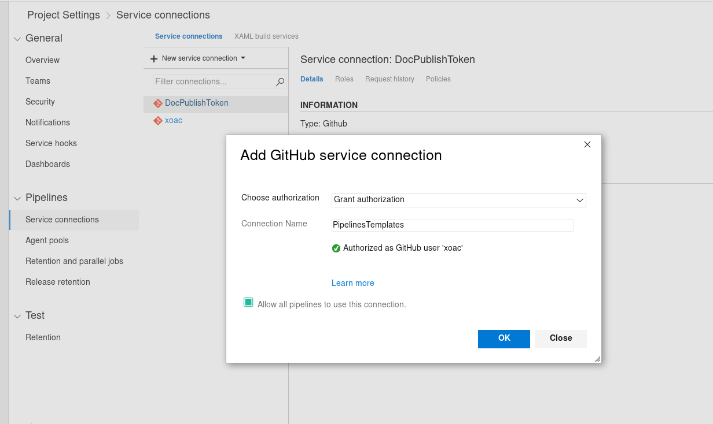
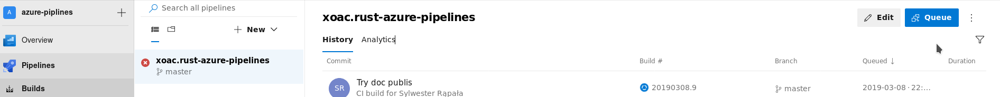
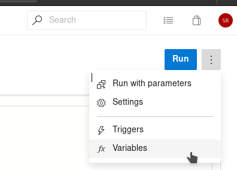
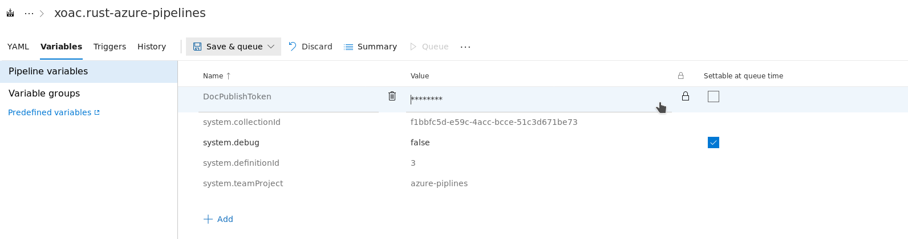

master: [](https://dev.azure.com/sylwesterrapala/azure-piplines/_build/latest?definitionId=3&branchName=master)  

develop: [](https://dev.azure.com/sylwesterrapala/azure-piplines/_build/latest?definitionId=3&branchName=develop)

# Status

This project is no longer maintained. I recommended using github actions for CI/CD with github I work on my personal template that contains a good defaults for github-actions at [xoac/opinionated-rust-template](https://github.com/xoac/opinionated-rust-template) if you still looking for Azure Pipelines for rust [crates-ci/azure-pipelines](https://github.com/crate-ci/azure-pipelines) should be a correct place.

# The idea

The idea of using this CI/CD is create common templates for rust users. It should be ready to work in 5min with good default values. It allow you:
 - check and tests:
   - on Windows, Linux, MacOs natively and with quemu for other targets
   - with any rust version you want (nightly, stable, 1.31 etc)
 - check formatting 
 - use lints (cargo clippy)
 - deploys to github (documentation and binaries)

## Copy past examples:

If you just started using azure pipelines you can copy paste into `azure-pipelines.yml`. **Check and test** should be good default one


#### Check and test
This is the default and should be sufficiently. [How to create endpoint?](https://github.com/xoac/rust-azure-pipelines/tree/develop#how-to-use-run-azure-pipelines)
```
trigger:
  branches:
    include: ['*']
  tags:
    include: ['*']

resources:
  repositories:
    - repository: rust_pipelines
      type: github
      name: xoac/rust-azure-pipelines
      ref: refs/tags/v0.1.0
      endpoint: PipelinesTemplates # TODO YOU NEED TO CHANGE THIS!

stages:
- stage: check
  displayName: "Quick checks"
  jobs:
  - template: ci/scenarios/check.yml@rust_pipelines

- stage: test
  displayName: "Multi OS native tests"
  jobs:
  - template: ci/scenarios/test.yml@rust_pipelines
    parameters:
      min_rust_supported: 1.31  # Use first rust version you wanna support
```

**You are done! Everything else is optional!**

### More stages:

#### Check and tests for embedded
<details>
Just modify `checks` and `tests`. This step use [cross project](https://github.com/rust-embedded/cross)

Check supported targets.
[Supported targets](https://github.com/rust-embedded/cross#supported-targets)

the name parameter is because we can't change automatically the name `mips-unknow-linux-musl` to `mips_unknow_linux_musl`. Name has to be unique in embedded stage.

```
# This stage allow to easy test your crate using cross project. 
# Supported targets: https://github.com/rust-embedded/cross#supported-targets
- stage: embedded
  displayName: "Cross check and tests"
  dependsOn:
    - check
  jobs:
  - template: ci/scenarios/embeeded.yml@rust_pipelines
    parameters:
      checks:
        - target: mips-unknown-linux-musl
          name: cross_chcek_i686_unknown_freebsd
        - target: aarch64-unknown-linux-gnu
          name: cross_check_aarch64_unknown_linux_gnu
      tests:
        - target: i686-unknown-linux-gnu
          name: cross_test_i686_unknown_linux_gnu
```
</details>

#### Build and deploy to github
<details>
Parameter `gitHubConnection` need to be changed. [More info](https://docs.microsoft.com/en-us/azure/devops/pipelines/tasks/utility/github-release?view=azure-devops#prerequisites)

```
# This stage build binaries - you can deploy them in next stage
- stage: build
  displayName: "Builds"
  condition: and(succeeded(), startsWith(variables['Build.SourceBranch'], 'refs/tags/v'))
  dependsOn:
    - test

# Deploy binaries to github only if tags start with `v` for example `v0.1.5`
- stage: deploy
  displayName: "Deploys"
  dependsOn:
    - build
  jobs: 
  - template: ci/scenarios/github/release.yml@rust_pipelines
    parameters:
      job_condition: and(succeeded(), startsWith(variables['Build.SourceBranch'], 'refs/tags/v'))
      gitHubConnection: PipelinesTemplates # CHANGED THIS TO YOUR OWN VALUE
```
</details>

## Add this repo templates to your project:
If you already have `azure-piplines.yml` file add this to be able using templates:
```
resources:
  repositories:
    - repository: rust_pipelines
      type: github
      name: xoac/rust-azure-pipelines
      # ref: refs/heads/master ## TODO you may want to change it to refs/tags/TAG_NAME.
      ref: refs/tags/v0.1.0
      endpoint: YOU_NEED_TO_SET_THIS
```
More about [templates resources](https://docs.microsoft.com/en-us/azure/devops/pipelines/process/templates?view=azure-devops#using-other-repositories)

And now you can use it like this:
```
jobs:
  - template: ci/jobs/cargo-check.yml@rust_pipelines
```
Available items:
```
ci
├── jobs
│   ├── cargo-build.yml
│   ├── cargo-check.yml
│   ├── cargo-clippy.yml
│   ├── cargo-doc.yml
│   ├── cargo-test.yaml
│   ├── cross-build.yml
│   ├── cross-check.yml
│   ├── cross-test.yml
│   └── rustfmt.yml
├── scenarios
│   ├── builds.yml
│   ├── check.yml
│   ├── embeeded.yml
│   ├── github
│   │   ├── deploy-doc.yml
│   │   └── release.yml
│   └── test.yml
└── steps
    ├── artifacts.yml
    ├── install-cross-rust.yml
    └── install-rust.yml
```

You can see `ci/scenarios` to get know how to use jobs.

### Intuitive:

The `ci` is split into:
 - steps     - common steps that are used in many jobs like install rust, publish artifacts etc. 
 - jobs      - here are defined jobs like rustfmt, cargo-\*, clippy etc.  
 - scenarios - groups jobs with good defaults parameters to allow easy check, test, build and deploy.

#### Using template jobs:
Most of pepole know how to use `cargo`. If you know you know also how to use this CI templates!

For example you wann use this:
```
cargo build --release --examples --target-dir "myTargetDir"
```
So you just need:
```
jobs:
 - template: ci/jobs/cargo-build.yml@rust_pipelines
   parameters:
     release: true
     examples: true
     target-dir: "myTargetDir"
```

How to check for more parameters? You can use just `--help` flag in cargo or see parameters in `cargo-build.yml`
```
cargo build --help
```

### How to use run azure-pipelines?
1. Create `azure-pipelines.yml` in your reposiotry
2. Specify [service connection](https://docs.microsoft.com/pl-pl/azure/devops/pipelines/library/service-endpoints?view=azure-devops)

3. Specify endpoint in resources.

### How to deploy doc to github pages? 
This is useful if u want to have a separate documentation for master branch.

<details>

#### Github part
1. First you need to create a PAT (Personal Access Token) on Github. (recommended scopes for the token: `repo`, `user`, `admin:repo_hook`.)
2. Then create a branch `gh-pages` and us it as repo page. [Here you find how to do it](https://help.github.com/en/articles/configuring-a-publishing-source-for-github-pages#enabling-github-pages-to-publish-your-site-from-master-or-gh-pages)

#### Azure part
1. Go to your azure dev-ops pipeline project and click edit.  
  
2. Go inside variables:  
  
3. Add variable called `DocPublishToken` with value of your PAT(Personal Access Token). Don't forget to mark it as secret.  
  
4. Edit azure-pipelines.yml section with doc deploy (parameters.git) and you are done.

Example master doc generated for this example create.
[master doc for this hello word app](https://xoac.github.io/rust-azure-pipelines/doc/rust_azure_pipelines/)

</details>

----

#### Sources:
* [Azure Pipelines for Rust Projects](https://nbsoftsolutions.com/blog/azure-pipelines-for-rust-projects)
* [tokio-rs](https://github.com/tokio-rs/tokio)

